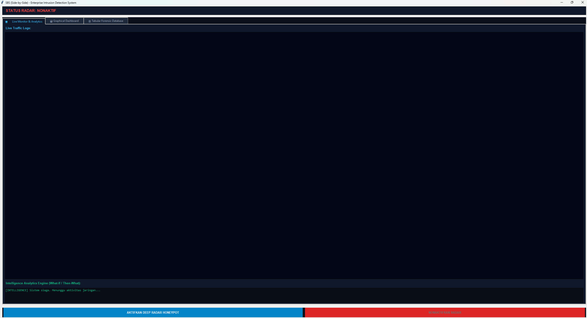
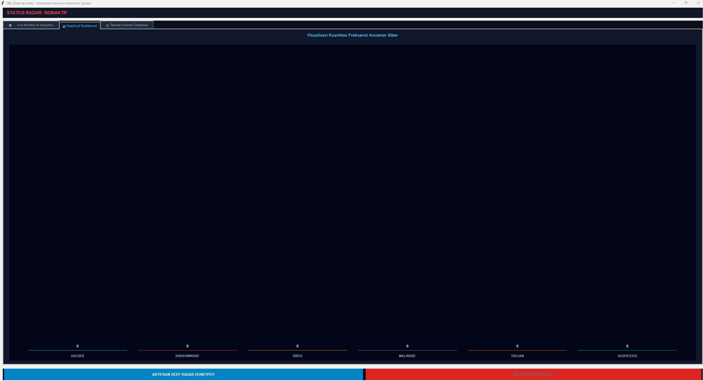
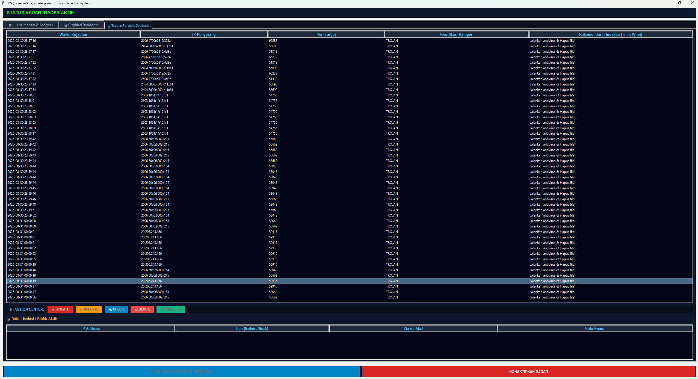
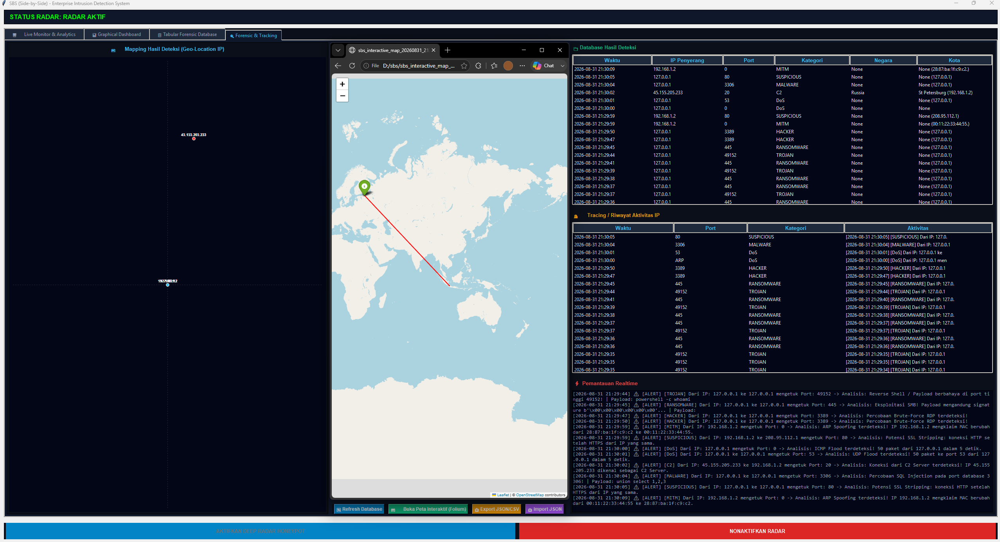

<p align="center">
  
  
  
  <br>
  
</p>

# 🛡️ SBS (Side‑by‑Side) — Enterprise Intrusion Detection System

**SBS** adalah sistem deteksi intrusi jaringan *inline* yang berjalan **berdampingan** (side‑by‑side) dengan sistem operasi Windows, tanpa Virtual Machine. Proyek ini menggabungkan **honeypot** dan **packet interceptor** untuk memantau, mendeteksi, dan merespons ancaman siber secara *real‑time*, sekaligus menjaga koneksi internet tetap lancar.

---

## ✨ Fitur Utama

- **Non‑Blocking (Side‑by‑Side)** — Setiap paket yang ditangkap langsung diteruskan kembali ke sistem, sehingga internet dan aplikasi tetap berjalan normal.
- **Deteksi Multi‑Kategori** — Mendeteksi **Hacker**, **Ransomware**, **Virus**, **Malware**, **Trojan**, **Suspicious**, **MITM/ARP Spoofing**, **DoS (ICMP/UDP Flood)**, dan **C2 (Command & Control)**.
- **Analisis Payload Lanjutan** — Menganalisis isi paket untuk mendeteksi **SQL Injection**, **XSS**, **Reverse Shell**, **Command Injection**, **ICMP Tunneling**, **SSL Stripping**, dan **C2 Beaconing**.
- **Dashboard Grafis Real‑Time** — Visualisasi statistik ancaman dalam diagram batang interaktif.
- **Forensic Database (SQLite)** — Tabel riwayat serangan lengkap dengan waktu, IP sumber, IP tujuan, port, kategori, dan **rekomendasi tindakan**.
- **Forensic & Tracking** — Tab khusus yang berisi:
  - **Peta Interaktif (Folium)** – menampilkan lokasi geografis IP penyerang dengan garis penghubung antar IP.
  - **Tracing / Riwayat Aktivitas IP** – riwayat lengkap setiap IP.
  - **Pemantauan Realtime** – log aktif secara langsung.
- **Action Center** — Tombol aksi nyata: **CHECK**, **ISOLATE**, **RELEASE**, **BLOCK**, dan **UNBLOCK** yang terintegrasi dengan Windows Firewall.
- **Export/Import Database** — Simpan seluruh hasil deteksi ke **JSON** atau **CSV**, dan impor kembali untuk analisis.
- **Notifikasi Alert** – Pop‑up dan suara saat ancaman terdeteksi (opsional).
- **Auto‑Block Response** – Blokir otomatis IP saat kategori **RANSOMWARE** atau **C2** terdeteksi (dapat diaktifkan/nonaktifkan).

---

## 📸 Tampilan Antarmuka (UI Preview)

### 1. Live Monitor & Analytics
Menampilkan log aktivitas jaringan secara langsung, beserta panel analitik prediktif (*What‑If / Then‑What*).



### 2. Graphical Dashboard
Visualisasi kuantitas frekuensi ancaman siber dalam bentuk diagram batang interaktif.



### 3. Tabular Forensic Database
Tabel riwayat serangan lengkap dengan kolom rekomendasi tindakan dan Action Center untuk merespons insiden.



### 4. Forensic & Tracking
Tab khusus untuk mapping, tracing, dan pemantauan real‑time.



---

## ⚠️ Peringatan Risiko

Proyek ini berjalan di level kernel menggunakan **WinDivert driver**. Kesalahan konfigurasi dapat menyebabkan ketidakstabilan sistem (*Blue Screen*) atau pemutusan koneksi internet.  
**Gunakan dengan risiko Anda sendiri.**

---

## 📋 Prasyarat

- **Python 3.10+** ([Download](https://www.python.org/downloads/))
- **WinDivert** driver (sudah disertakan dalam folder proyek)
- Hak **Administrator** untuk menjalankan perintah firewall dan mengakses driver jaringan

---

## 🚀 Panduan Instalasi

### 1. Clone / Salin Proyek
```bash
git clone https://github.com/duhemen/sbs.git
cd sbs
```

### 2. Buat Virtual Environment
```bash
python -m venv venv
```

### 3. Aktifkan Virtual Environment
- **Windows (CMD/PowerShell)**:
  ```bash
  .\venv\Scripts\activate
  ```
- **Linux/macOS**:
  ```bash
  source venv/bin/activate
  ```

### 4. Instal Dependensi
```bash
pip install -r requirements.txt
```

### 5. Pastikan WinDivert.dll & WinDivert.sys Ada
Letakkan kedua file tersebut di **folder root proyek** (seperti `D:\sbs\`).

---

## 🕹️ Cara Menggunakan SBS

### Menjalankan Aplikasi
Buka terminal **sebagai Administrator**, lalu jalankan:
```bash
python main.py
```
Jendela GUI akan muncul.

### Mengaktifkan Radar
- Klik tombol **"AKTIFKAN DEEP RADAR HONEYPOT"**.
- Status berubah menjadi **"RADAR AKTIF"** (hijau).
- Sistem akan mulai menangkap paket pada port‑port kritis (FTP, SSH, SMB, RDP, Database, dll).

### Membaca Dashboard
- **Tab Live Monitor** — Menampilkan log aktivitas secara langsung.
- **Tab Graphical Dashboard** — Grafik batang jumlah serangan per kategori.
- **Tab Tabular Forensic Database** — Tabel riwayat lengkap dengan kolom rekomendasi.

### Menggunakan Action Center
1. Pilih salah satu baris di tabel forensik.
2. Tombol aksi akan aktif.
3. Klik:
   - **🔍 CHECK** — Membuka AbuseIPDB untuk analisis reputasi IP.
   - **🔒 ISOLATE** — Membuat aturan firewall untuk memblokir IP sementara.
   - **🔓 RELEASE** — Menghapus aturan isolasi.
   - **🚫 BLOCK** — Memblokir IP secara permanen di firewall.
   - **✅ UNBLOCK** — Menghapus aturan blokir.

### Menggunakan Forensic & Tracking
- **Buka Peta Interaktif** — Klik tombol **"🗺️ Buka Peta Interaktif (Folium)"** untuk menampilkan peta dunia dengan marker berwarna sesuai kategori dan garis penghubung antar IP.
- **Export/Import** — Klik tombol **"📤 Export JSON/CSV"** atau **"📥 Import JSON"** untuk menyimpan/memuat data deteksi.

---

## 📂 Struktur Proyek

```
sbs/
├── main.py                 # Aplikasi GUI utama (Tkinter)
├── requirements.txt        # Dependensi Python
├── README.md               # Dokumentasi
├── .gitignore              # Konfigurasi Git
├── config.json             # (Opsional) Konfigurasi Threat Intelligence & Auto-Block
├── WinDivert.dll           # Driver WinDivert (32/64-bit)
├── WinDivert.sys           # Driver sistem WinDivert
├── test_sbs.py             # Skrip pengujian otomatis
├── test_mitm.py            # Skrip pengujian MITM/DoS/C2 (lanjutan)
├── assets/                 # Screenshot untuk dokumentasi
│   ├── Live_Monitor_analytics.png
│   ├── Graphical_Dashboard.png
│   ├── Tabular_Forensic_Database.png
│   └── Forensic_Tracking.png
└── src/
    ├── __init__.py
    ├── interceptor.py      # Thread penangkap paket & re‑inject (WinDivert + Scapy)
    ├── honeypot.py         # Logika deteksi ancaman (TCP, UDP, ICMP, ARP)
    ├── database.py         # Database SQLite untuk menyimpan deteksi
    └── logger.py           # Pencatat log ke file (dengan rotasi)
```

---

## 🧪 Pengujian Cepat

Setelah radar aktif, jalankan skrip pengujian berikut di terminal terpisah:

```bash
python test_sbs.py
```

Ini akan mensimulasikan serangan ke port 445, 3389, 49152, dan 8080. Lihat GUI SBS untuk melihat hasil deteksi.

Untuk menguji fitur lanjutan (MITM, DoS, C2, dll):

```bash
python test_mitm.py
```

---

## 🛠️ Troubleshooting

| Masalah | Solusi |
|---------|--------|
| **Internet mati saat radar aktif** | Pastikan Anda menggunakan versi `interceptor.py` yang **re‑inject** paket (sudah diperbaiki). |
| **Tombol firewall tidak berfungsi** | Jalankan aplikasi sebagai **Administrator**. |
| **Tidak ada deteksi** | Periksa filter di `interceptor.py`; pastikan WinDivert driver terbaca. |
| **Error saat import pydivert** | Jalankan `pip install pydivert==2.1.0`, pastikan `WinDivert.dll` ada di folder. |
| **Peta interaktif tidak terbuka** | Pastikan library `folium` terinstal (`pip install folium`). |

---

## 🔮 Pengembangan Kedepan

Fitur‑fitur berikut sedang direncanakan dan akan ditambahkan pada iterasi berikutnya:

### 1. Integrasi Threat Intelligence (Multi‑Provider)
- Dukungan untuk **AbuseIPDB**, **VirusTotal**, **AlienVault OTX**, atau **API kustom**.
- Pengaturan provider dan API key melalui **UI Settings** (tanpa hardcode).
- Pembaruan otomatis daftar IP jahat secara berkala.

### 2. Otomatisasi Respons yang Lebih Fleksibel
- Pilihan kategori yang dapat di‑auto‑block (user dapat memilih).
- Integrasi dengan **router** (MikroTik, pfSense) untuk pemblokiran di tingkat jaringan.

### 3. Notifikasi yang Dapat Dikonfigurasi
- Opsi notifikasi pop‑up, suara, atau **telegram/email**.
- Throttle pengiriman notifikasi agar tidak spam.

### 4. Penyimpanan Log Terstruktur
- Format **JSONL** untuk analisis dengan Elasticsearch atau tools SIEM.
- Rotasi otomatis log berdasarkan ukuran atau waktu.

### 5. Peta Interaktif Langsung di UI
- Menampilkan peta dunia **di dalam GUI** (tanpa membuka browser).
- Menggunakan library seperti `folium` yang di‑embed ke Tkinter.

### 6. Deteksi Serangan Tambahan
- **ICMP Tunneling** yang lebih mendalam.
- **SQL Injection pada port non‑web** (MySQL, PostgreSQL, MongoDB) – sudah ada.
- **C2 Beaconing** dengan analisis interval waktu dan payload.
- Deteksi **DNS Tunneling** yang lebih kompleks.

### 7. Integrasi dengan SIEM / Syslog
- Kirim log deteksi ke server syslog atau SIEM eksternal.

---

## 📜 Lisensi

Proyek ini bersifat **proprietary** untuk keperluan riset dan internal. Dilarang mendistribusikan ulang tanpa izin penulis.

---

<p align="center">
  Dibuat dengan ❤️ oleh <b>YourSelf</b> — <i>Enterprise Security Research</i>
</p>
